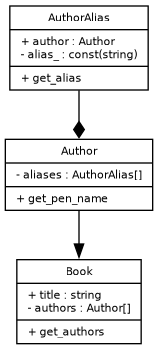

## duml-class-gen

Single file library to create UML class diagrams in the
[dot language](https://www.graphviz.org/doc/info/lang.html) from a list of D
classes

**Optional Dependencies**:
- [graphviz](https://graphviz.org/) - For converting a dot file into an image

### Example:
#### D code:
```d
import duml_class_gen;

class AuthorAlias {
    Author author; // reference to author
    private const string alias_;

    string get_alias() => alias_;
}

class Author {
    private AuthorAlias[] aliases;

    // First alias is Pen-name
    string get_pen_name() => aliases[0].get_alias();
}

class Book {
    string title;
    private Author[] authors;

    const(Author[]) get_authors() => authors;
}

void main() {
    import std.stdio;

    File f = File("diagram.dot", "w");
    f.write(
        create_uml_diagram!(Book, Author, AuthorAlias)
            .append_relations("AuthorAlias", "--*", "Author") // Composition
            .append_relations("Author", "-->", "Book") // Dependency
    );
    f.close();
}
```

#### Terminal:
`dot -Tpng diagram.dot -o diagram.png`

#### Resulting image:


### Converting to png:
store the result of `create_uml_diagram` in a .dot file:

Using graphviz convert dot file to png with:
```sh
dot -Tpng -o diagram.png
```

### TODO:
- Add ability to set style
- Add unitests
